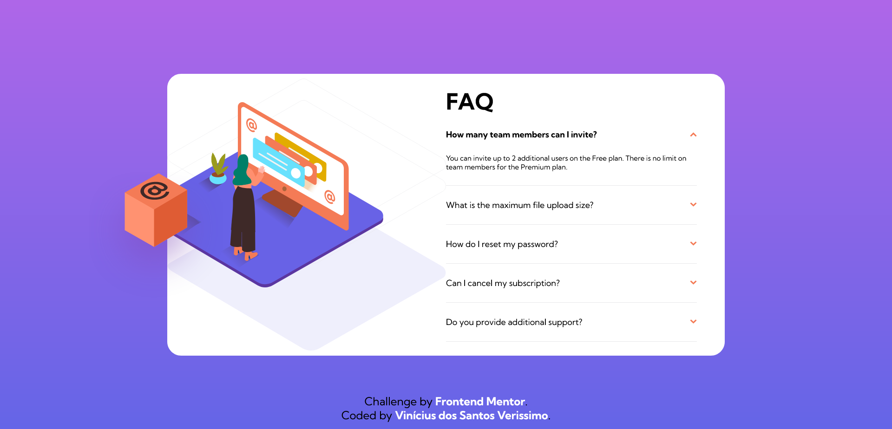

# Frontend Mentor - FAQ accordion solution

This is a solution to the [Order summary card challenge on Frontend Mentor](https://www.frontendmentor.io/challenges/order-summary-component-QlPmajDUj). 

## Overview

### Screenshot

### Links

- Solution URL: https://viniciusdsv93.github.io/FAQ-accordion/

## My process

### Built with

- Semantic HTML5 markup
- CSS custom properties
- Flexbox
- JavaScript

### What I learned

I was able to use JavaScript to turn on the display of the answers when the questions were clicked.

## Author

- GitHub - Vinícius dos Santos Verissimo (https://github.com/viniciusdsv93)
